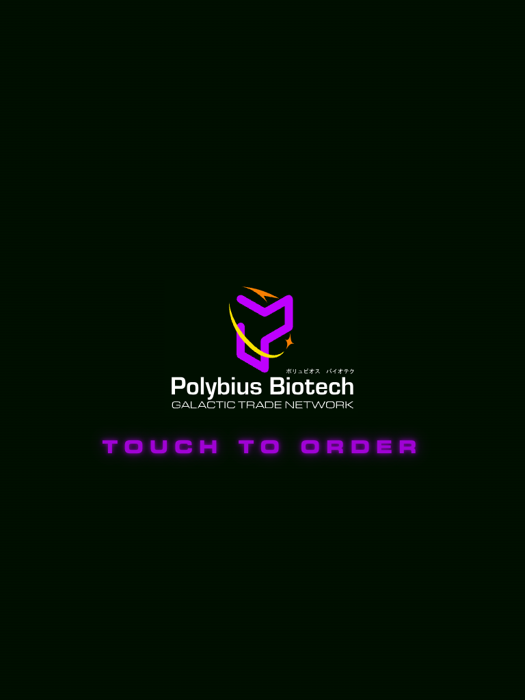
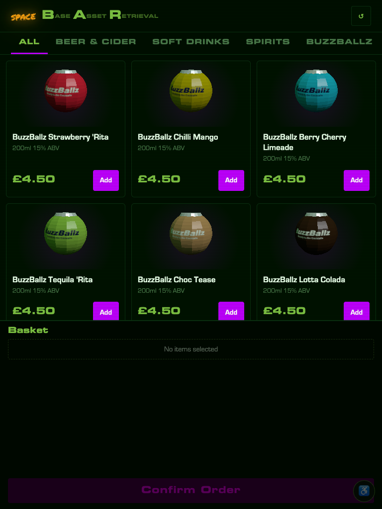
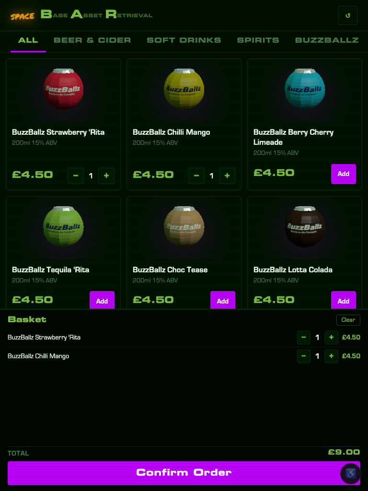
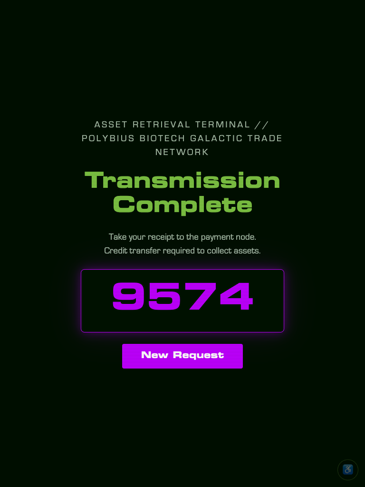

# Spacebar Kiosk

Customer-facing Raspberry Pi touchscreen kiosk for creating unpaid drink orders
in tillweb. The kiosk shows stock for one configured till location, sends the
basket to tillweb, prints the returned unpaid order slip locally, and shows the
customer the order ref to take to a human-operated till.

## Screenshots

| Sleep screen | Product grid | Basket | Order placed |
|:---:|:---:|:---:|:---:|
|  |  |  |  |

> Screenshots taken in mock mode (`KIOSK_MOCK_MODE=true`). Run `npm start` with those env vars to reproduce locally.

## Runtime Shape

- A Node.js server serves the kiosk UI on localhost (runtime dependency: `@spacebar/shared` — see [Dependencies](#dependencies) below). Slip printing is complete — ESC/POS 1D (ITF) barcode via `src/slip.js`, including a working logo pipeline: `buildLogoBytes()` shells out to ImageMagick to rasterize `public/images/poly claw.bmp` into ESC/POS bytes, falling back to an empty buffer only if ImageMagick isn't available. **Outstanding before site:** a physical test print on the U220A to verify scale, columns, and ribbon colour.
- The browser never sees the tillweb bearer token; the local server proxies API
  calls to tillweb.
- Slips print through CUPS using `lp` by default.
- Raspberry Pi kiosk mode is handled with systemd services for the server and
  Chromium.
- The UI is designed for a portrait touchscreen, with products above and the
  running basket plus `Confirm order` action fixed at the bottom of the screen.

## Local Development

```sh
cp .env.example .env
$EDITOR .env
npm start
```

For local UI work without a printer, set:

```sh
KIOSK_PRINT_ENABLED=false
KIOSK_MOCK_MODE=true
```

Then open `http://127.0.0.1:8080`.

## Raspberry Pi Install

On Raspberry Pi OS with Node.js 20+, git, Chromium, CUPS, ImageMagick
(`sudo apt install imagemagick` — required to rasterize the logo for slip
printing; the logo silently doesn't print without it), and a configured
printer. `ops/install-pi.sh` runs `npm install` on the Pi, and `@spacebar/shared`
is a git dependency — the Pi needs internet access to GitHub during install.

```sh
sudo ./ops/install-pi.sh
sudoedit /etc/spacebar-kiosk.env
sudo systemctl restart spacebar-kiosk.service spacebar-kiosk-browser.service
```

The systemd units run as `APP_USER`, which defaults to `pi`. If the Pi's login
account is something else (e.g. `emf`), set it explicitly so the install
matches the account actually running the desktop session:

```sh
sudo APP_USER=emf ./ops/install-pi.sh
```

Required settings:

- `TILLWEB_BASE_URL`: tillweb base URL, such as `https://till.example.org`.
- `TILLWEB_KIOSK_TOKEN`: bearer token from `emftillweb`'s
  `[kiosk.tokens]` configuration.
- `KIOSK_LOCATION`: tillweb stock/order location, default `spacebar`.

Useful optional settings:

- `KIOSK_PRINTER_NAME`: CUPS printer name. Blank uses the default printer.
- `KIOSK_PRINT_COMMAND`: `lp` or `lpr`.
- `KIOSK_PORT`: local HTTP port, default `8080`.
- `KIOSK_USE_STOCK_IMAGES`: show each product's real tillweb stocktype logo
  instead of the bobbing 3D model, and skip creating a WebGL context
  entirely. Use this on weak-GPU Pis (e.g. Pi 3). Products without a logo
  set in tillweb just show a plain empty card.

Remote operations — required if the kiosk is unattended:

- `KIOSK_OMS_URL`: base URL of the OMS server (e.g. `http://192.168.x.x:8081`). When set: (1) printer errors are POSTed to `/api/printer-alert` so the OMS staff screen can alert bar staff; (2) the kiosk server subscribes to OMS SSE on startup to receive maintenance mode changes — the full-screen "TERMINAL OFFLINE" overlay is driven by this. If not set, printer failures are visible on the kiosk screen but invisible to staff, and maintenance mode can only be set directly via `POST /api/maintenance` on the kiosk itself. Requires that the kiosk can reach the OMS server — confirm camp-network → VLAN routing with Luke before site.
- `KIOSK_PRINTER_DEVICE`: USB device path for ESC/POS hardware status queries (e.g. `/dev/usb/lp0`). When set, the kiosk sends a `DLE EOT` status query to the printer before every print job, detecting paper-out, cover-open, and ribbon errors that CUPS/`lpstat` cannot see. Find the path with `ls /dev/usb/lp*`. Requires the kiosk user to be in the `lp` group (`sudo usermod -a -G lp $USER` — the CUPS install adds `lpadmin` but not `lp`). Leave blank to skip — CUPS-level detection (USB disconnection) remains active regardless.
- `KIOSK_LISTEN_HOST`: host to bind the local server, default `127.0.0.1`. Set to `0.0.0.0` if you need the kiosk UI reachable from another device.
- `KIOSK_DUMMY_PRINT`: if `true`, renders the slip to a file in `/tmp` instead of sending to CUPS. Useful for testing slip layout without a printer. Independent of `KIOSK_MOCK_MODE` — leave this `false` to print to a real printer while using mock till data (e.g. testing slip/hardware changes without a live tillweb connection).

## Operations

Check status:

```sh
systemctl status spacebar-kiosk.service
systemctl status spacebar-kiosk-browser.service
```

Read logs:

```sh
journalctl -u spacebar-kiosk.service -f
journalctl -u spacebar-kiosk-browser.service -f
```

Health check:

```sh
curl http://127.0.0.1:8080/healthz
```

## Customer Flow

Customers tap drinks to add them to the running basket at the bottom of the
screen, adjust quantities there, then press `Confirm order`. The kiosk creates
an unpaid order in tillweb, prints the order slip, and shows the order number.

If stock changes while the customer is ordering, the kiosk refreshes the product
list and asks them to review the basket. If the order is created but printing
fails, the kiosk shows a staff/help state and does not create another order.

## Product Images and Metadata

Category tabs are derived automatically from the quicktill **department** field
on each stocktype — no configuration needed. To change which tab a product
appears under, change its department in quicktill.

Per-product display overrides are configured in `public/products.json`, keyed
by quicktill stockline ID:

```json
{
  "42": {
    "image": "/images/products/some-beer.jpg",
    "category": "Craft Beer"
  },
  "43": { "model": "ball", "color": "#1e90ff" }
}
```

| Field | Description |
|---|---|
| `image` | URL of a product image. Put files in `public/images/products/` and reference as `/images/products/filename.jpg`. Recommended: at least 400 × 280 px (card image area is 140 px tall). Setting an image replaces the 3D model for that product. |
| `category` | Overrides the quicktill department for tab assignment. Useful if the till department names don't match what you want shown on the kiosk, or to split one department across multiple tabs. |
| `model` | Overrides the 3D model shape: `can`, `ball` (BuzzBallz), or `bottle`. By default it's inferred from the name/category. |
| `color` | Overrides the 3D model colour (any CSS colour, e.g. `#1e90ff`). By default it's guessed from the flavour in the product name. |
| `color2` | Optional second colour for a two-tone can: bottom 2/3 uses `color2`, top 1/3 uses `color`. "& Coke" mixers get this automatically (cola-brown body, spirit-coloured top band). |

All fields are optional. Products without an entry show a bobbing low-poly 3D
model (colour and shape inferred from the name/category) and use the quicktill
department as their category.

### 3D product models

Each card shows a small, cheap low-poly model that bobs and spins (`public/scene.js`).
Models are built procedurally — there are no asset files to manage. three.js is
vendored at `public/vendor/three.module.js` so the kiosk renders fully offline.

The renderer is tuned for the Raspberry Pi: one shared WebGL context for the whole
grid, no antialiasing, flat-shaded materials, ~2 meshes per model, 30 fps, and
off-screen cards are skipped. It pauses entirely on the sleep and confirmation
screens. If WebGL is unavailable it falls back silently to an empty card.

Stockline IDs come from the quicktill database (`stockline.id`).

## Other endpoints

| Endpoint | Notes |
|---|---|
| `GET /api/config` | Returns `{ location, print_enabled, mock_mode, ready, missing }`. Used by the client on load to check the kiosk is configured and ready before enabling ordering — `ready` is always `true` in mock mode, otherwise `missing` lists any required settings (see above) that aren't set. |
| `POST /api/sale-positions` | Body: `{ order_ref, buzzballz_sold: [{ position, name, qty }] }`. Logs which shelf position each BuzzBallz sale came from, for a merchandising placement test. Console-only — nothing is persisted. |

## Maintenance mode

A full-screen "TERMINAL OFFLINE" overlay can be shown on the kiosk to halt ordering. There are two independent kinds of maintenance state, both surfaced to the kiosk's browser UI as a single merged `maintenance` SSE event on `/api/events`:

- **Site-wide `maintenance`** — affects every screen (badge, kiosk, till, OMS). Pushed from the OMS when `KIOSK_OMS_URL` is set, or can be set directly on the kiosk with `POST /api/maintenance` below.
- **Kiosk-only `kiosk-maintenance`** — halts ordering on the kiosk (and badge) while OMS staff/customer/pay screens stay live. This is pushed to the kiosk only as a `kiosk-maintenance` SSE event from the OMS; there is no kiosk-side endpoint to set it. It's set on the OMS itself (`POST /kiosk-maintenance` there — see the OMS README) and requires `KIOSK_OMS_URL` to reach the kiosk at all.

The kiosk merges the two: its own `/api/events` reports `active: true` if either the site-wide or kiosk-only flag is active.

| Endpoint | Notes |
|---|---|
| `GET /api/events` | SSE stream. Sends a `maintenance` event with `{ active, reopeningAt }` on connect (replay) and whenever either upstream state changes. |
| `POST /api/maintenance` | Body: `{ active, reopeningAt? }`. Sets the **site-wide** maintenance flag locally; if OMS is connected the OMS is the authoritative source and will override this on the next SSE update. Does not affect kiosk-only (`kiosk-maintenance`) state, which can only be set via the OMS. |

## Dependencies

Runtime: `@spacebar/shared` (shared HTTP and tillweb helpers).

`@spacebar/shared` is fetched from [PolybiusBiotech/spacebar-shared](https://github.com/PolybiusBiotech/spacebar-shared) by `npm install` — no manual setup needed.

## Tillweb API

The kiosk server fetches products from the public EMF stockline API:

```text
GET /api/stocklines.json?output=full&type=continuous&location=<location>
```

It creates unpaid saved orders through the private kiosk API:

```text
POST /api/kiosk/orders/
```

The private API requires a bearer token. The browser UI never sees that token; only the local Node.js server sends it to tillweb.
